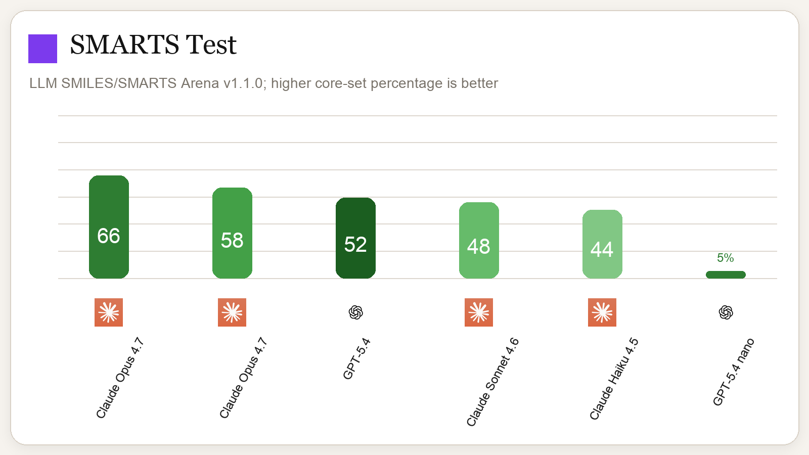
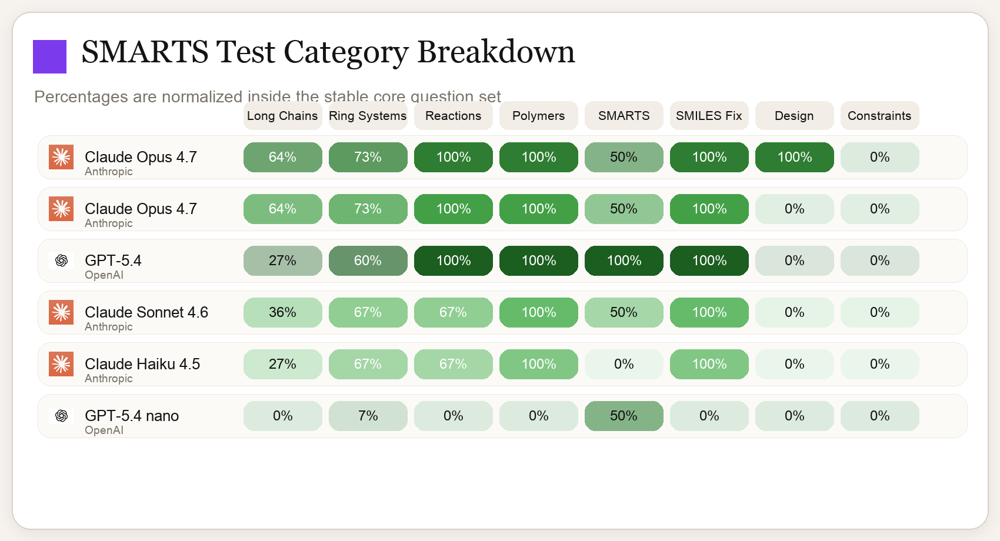

# LLM SMILES/SMARTS Arena

A benchmark suite for evaluating large language models on chemical string reasoning with SMILES, SMARTS, and SMIRKS.

## Overview

This benchmark is designed to stress tokenization-sensitive structure reasoning, not just broad chemistry recall. The public benchmark also includes explicit unscored `Diagnostic` items. Those items are part of the prompt and required JSON output, but they do not affect the public score, core score, or figures.

The live public benchmark version is **v1.1.0**. The public scoring lineage is defined by:

- `smiles_llm_benchmark_questions.md`
- `smiles_llm_grader_v1.py`
- `benchmark_manifest.py`

Trusted scoring material is not committed to this repository. The public answer key is intentionally limited, and optional trusted grading can be layered in locally through ignored private files.

## Repository Structure

```text
llm-smarts-arena/
├── smiles_llm_benchmark_questions.md   # Public benchmark prompt
├── smiles_llm_grader_v1.py             # Public scorer for the tracked benchmark
├── benchmark_manifest.py               # Public/scored/diagnostic/core question sets
├── benchmark_runner_utils.py           # JSON parsing, artifact routing, secret-loader helpers
├── run_smiles_benchmark_claude.py      # Anthropic runner
├── run_smiles_benchmark_openai.py      # OpenAI runner
├── compare_benchmark_results.py        # Shareable PNG figure renderer
├── generate_answer_key.py              # Rebuilds the public answer-key document
├── answer_key.md                       # Public human-readable key
├── outputs/                            # Shareable public artifacts only
└── .benchmark_private/                 # Ignored local trusted assets and raw logs
```

## Quick Start

### Installation

```bash
python -m venv venv
source venv/bin/activate
pip install -r requirements.txt
```

### Setup API Keys

```bash
cp .env.example .env
# Add ANTHROPIC_API_KEY and/or OPENAI_API_KEY
```

### Run Benchmark

**Using the automated skill (recommended):**

```bash
# Run any supported model - automatically detects family and wires up API
python ~/.cursor/skills/run-smiles-benchmark/run_smiles_benchmark_skill.py "claude-opus-4-7"
python ~/.cursor/skills/run-smiles-benchmark/run_smiles_benchmark_skill.py "gpt-5.4"

# The skill will:
# 1. Detect the model family (Claude/OpenAI)
# 2. Check API keys in .env
# 3. Run the benchmark with no tool use, no extended thinking
# 4. Grade the submission
# 5. Regenerate all comparison graphs
```

**Manual runners:**

```bash
# Anthropic
python run_smiles_benchmark_claude.py --model claude-sonnet-4-6

# OpenAI
python run_smiles_benchmark_openai.py --model gpt-5.4-nano
```

Each run writes public artifacts under `outputs/<family>/<model>/<timestamp>/`:

- `summary.json`: public score, core score, and parse status
- `grade_result.json`: sanitized per-question earned/max only
- `run_meta.json`: benchmark version, public/scored/diagnostic/core ids, and summary

Raw model traces, submissions, usage, struggle reports, and any trusted-only grading artifacts are written only under the ignored `.benchmark_private/` tree.

## Public vs Trusted Grading

- Public score uses only `SCORED_QUESTION_IDS` from `benchmark_manifest.py`.
- `DIAGNOSTIC_QUESTION_IDS` are required in the prompt output but excluded from public percentages and figures.
- `CORE_QUESTION_IDS` remain the stable comparison subset for graphing.
- If `.benchmark_private/secret_benchmark.py` exists and exposes `grade_submission(payload)`, the runners also write trusted local grading artifacts under `.benchmark_private/runs/...`.

## Results

Benchmark results are visualized as PNG charts in the `figures/` directory. All figures are version-controlled to preserve historical comparisons.

### Main Leaderboard (All Models)

**Tokenizer Stress Test** — Overall performance across all models:



**Category Breakdown** — Performance by question category:



### Per-Family Results

- [Claude family results](figures/claude/)
- [OpenAI family results](figures/openai/)

### Rebuild Figures

After adding new benchmark results, regenerate all graphs:

```bash
# Regenerate all family-specific and combined graphs
python compare_benchmark_results.py \
  outputs/claude/claude-sonnet-4-6/20260417T155306Z \
  outputs/claude/claude-haiku-4-5/20260417T155307Z \
  outputs/openai/gpt-5-4-nano/20260417T155307Z \
  --output-prefix figures/combined/benchmark_percentages

# Family-specific (Claude)
python compare_benchmark_results.py \
  outputs/claude/claude-sonnet-4-6/20260417T155306Z \
  outputs/claude/claude-haiku-4-5/20260417T155307Z \
  --output-prefix figures/claude/benchmark_percentages

# Family-specific (OpenAI)
python compare_benchmark_results.py \
  outputs/openai/gpt-5-4-nano/20260417T155307Z \
  --output-prefix figures/openai/benchmark_percentages
```

## Answer Key

Rebuild the current public human-readable key:

```bash
python generate_answer_key.py
```

The tracked `answer_key.md` does not contain trusted scoring material.

## Contributing

See [CONTRIBUTING.md](CONTRIBUTING.md) for question/versioning policy and for the direct-contact rule if you believe a question has a chemical error or ambiguity.

## License

MIT License. See [LICENSE](LICENSE).
